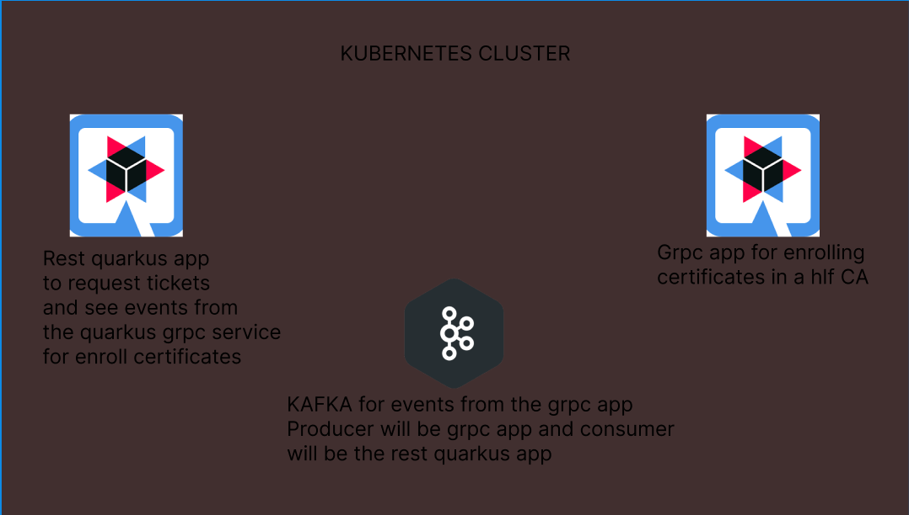

# Info
- This is a micro-services project that we will implement with quarkus and also kafka
# Showcase

# Patterns in it
- Client-Server Architecture
  - We will have a client requesting tickets to rest quarkus and then requesting a certificate using that ticket to grpc app
- Event-Driven Architecture
  - Grpc app produces events and the rest quarkus will consume them
- Message Broker Pattern
  - Kafka is a message broker for the quarkus app and the grpc app
- Service Oriented Architecture
  - Both rest and grpc have well-defined interfaces to communicate with each other
- Containerization and Orchestration
  - Kubernetes will orchestrate those containers
# Rest Quarkus dependencies
- quarkus-rest
  - For rest api
- Apache kamel for kafka
  - For communciating with kafka
- Junit5
  - For unit testing
- rest assured
  - For making assertions over http requests
- Rest resourses for Hibernate ORM with Panache (JPA)
  - For accesssing the db as well
- Hibernate ORM with Panache
  - For accessing the db as well but more like a extension for JPA
- OpenAPI Generator - REST Client Generator
  - For api
- JDBC Driver-PostgreSQL
  - Drivers for postgresql db
- org.json
  - For working with json objects
- junit5 mockito
  - This is a junit precisely just for mockito
# Grpc app dependencies
- grpc-quarkus
- Apacha Kamel for Kafka
- Junit5
# Notes
- For some reason not either lombok and not either mapstruct were working 